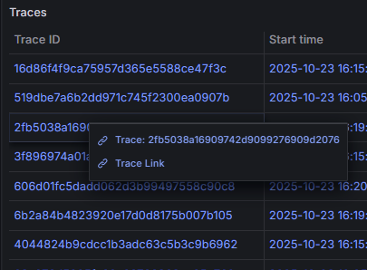
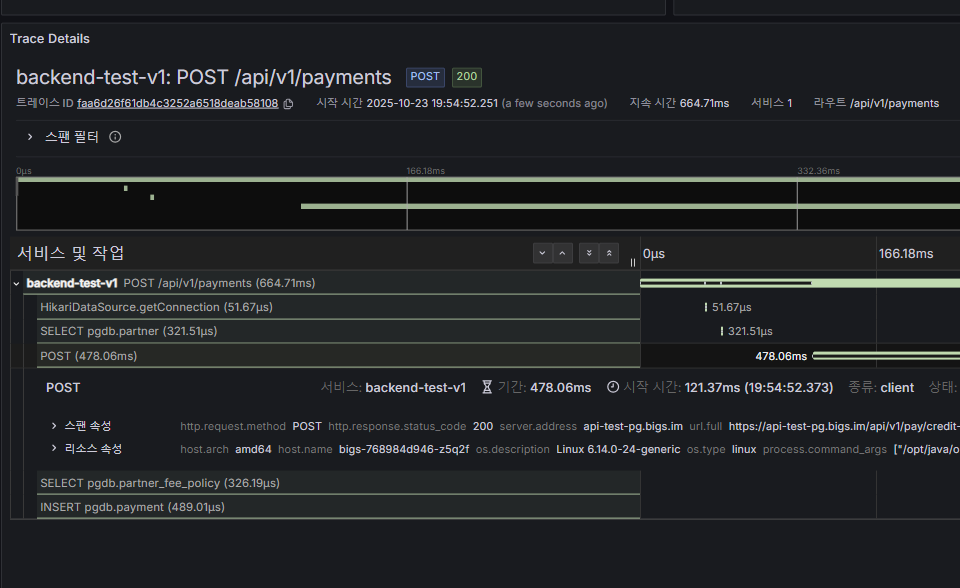

# 과제 추가 설명

## 환경 변수

애플리케이션 실행 시 다음의 환경 변수를 설정이 필요합니다.

### OpenTelemetry 설정
- `OTEL_EXPORTER_ENDPOINT`: OTLP 엔드포인트 URL (기본값: `http://localhost:4317`)
- `OTEL_EXPORTER_OPTION`: Exporter 활성화 옵션 - `otlp` 또는 `none` (기본값: `none`)

### SpringDoc 설정
- `SPRINGDOC_SERVER_URL`: 실제 API 요청을 보낼 서버 URL (기본값: `http://localhost:8080`)
- `SPRINGDOC_SERVER_DESCRIPTION`: 서버 설명 (기본값: `localhost`)

### 예시

```properties
# OpenTelemetry 설정
OTEL_EXPORTER_ENDPOINT=http://otel-collector:4317
OTEL_EXPORTER_OPTION=otlp

# SpringDoc 설정
SPRINGDOC_SERVER_URL=https://api.example.com
SPRINGDOC_SERVER_DESCRIPTION=Production
```

## 개발 프로세스

1. 과제 진행에 필요한 이슈 생성
2. main 브랜치에서 작업 진행을 위한 브랜치 생성
3. [커밋 컨벤션](https://www.conventionalcommits.org/ko/v1.0.0/)을 준수해 타입에 맞게 커밋
4. Claude Code Sub Agent를 통해 PR 생성
5. 생성된 PR에서 CI Workflow 통과 시 `squash and merge` 로 병합

## Claude Code Sub Agent 활용

개발 효율성을 높이기 위해 Claude Code의 Sub Agent 기능을 활용했습니다.

> [github-manager agent](github-manager.md)

### 활용 목적
- 반복적인 Issue/PR 생성 작업 자동화로 개발 시간 단축
- 템플릿 기반 일관된 이슈 관리 및 문서화

### 예시 프롬프트 

- 이슈 생성 요청
    ```
    @agent-github-manager 선택 과제 구현을 위해 오픈 API 문서화, 간단한 운영지표(로그/메트릭) 구현이 필요합니다. 이슈를 생성해주세요.
    ```

- PR 생성 요청
    ```
    @agent-github-manager 현재 작업한 코드는 이슈 1번의 작업 코드입니다. pr을 생성해주세요.
    ```

## 추가 구현 내용

#### GitHub Actions CI

개발 품질을 높이기 위해 ci workflow를 작성해 테스트 - Docker 이미지 빌드 과정을 수행하도록 구현했습니다.

**구현**:
- 멀티스테이지 빌드를 사용한 `Dockerfile` 추가
- `PR`, `Push` 이벤트 발생 시 전체 테스트 실행 및 `ktlintCheck` 실행
- `main` 브랜치에 병합 발생 시 Docker 이미지 빌드 후 `ghcr`로 push

#### SpringDoc OpenAPI 문서화

- `springdoc-openapi-starter-webmvc-ui` 의존성 추가
- Swagger UI를 통한 API 테스트 (`/swagger-ui.html`)
- 모든 엔드포인트에 간단한 설명 및 파라미터 예제 포함

#### OpenTelemetry 통합

OpenTelemetry 기반의 결제 관련 메트릭을 수집하고 시각화 할 수 있도록 구현했습니다.

**구현**:
- 결제 도메인 특화 메트릭 수집 포트 및 어댑터 구현
- 로그에 Trace/Span ID 자동 포함
- 자동 계측: HTTP, DB 쿼리, 외부 API 호출
- 결제 승인과 관련된 지표 수집
    - `payment.amount`: 결제 금액 분포
    - `payment.fee`: 수수료 금액 분포
    - `payment.net`: 순수익 금액 분포

## 배포

### API Docs

[Swagger UI](http://db.luigi99.cloud:30310)

로컬 환경없이도 테스트하실 수 있도록 배포 환경을 구축했습니다. 위 링크에서 API 테스트 가능합니다.

### Grafana 대시보드

[빅스페이먼츠 Test PG 서버 대시보드](https://grafana.luigi99.cloud/)  

Grafana 대시보드에서 간단한 지표, 로그, 트레이스에 대한 Grafana 대시보드 확인 가능합니다.

> ID: `bigscoltd`, PW: `QuELP$+9c3K4`

| Traces 목록           | Trace 상세 정보             |
|---------------------|-------------------------|
|  |  |

`Trace Link` 클릭해서 자세한 확인 가능하도록 패널을 구성했습니다.